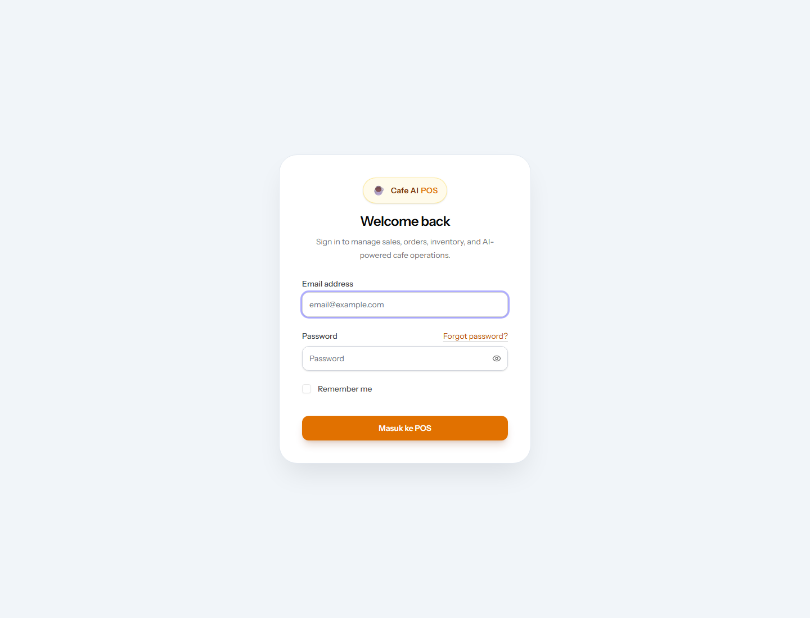
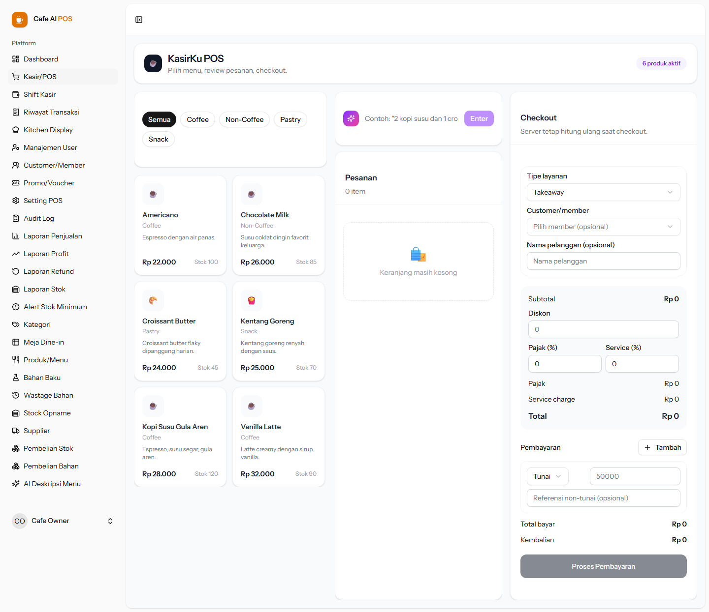
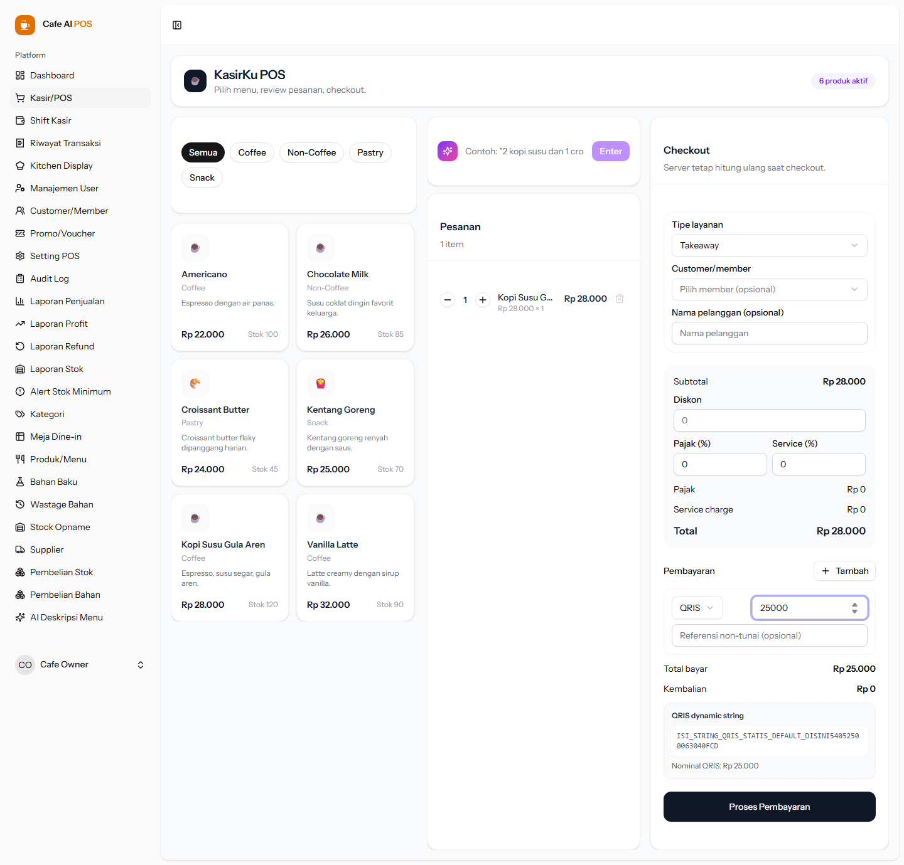
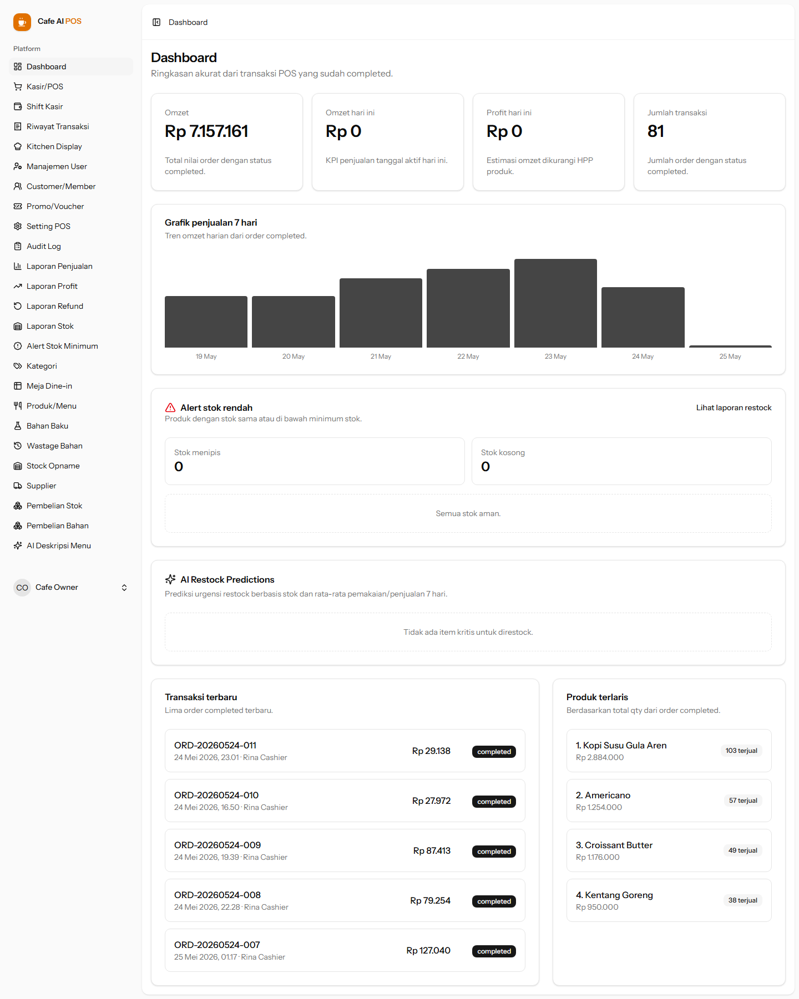

# Cafe AI POS - Enterprise Point of Sale System


**Cafe AI POS** is an enterprise-grade Point of Sale platform for cafes, restaurants, and food-service operators. It combines Laravel 13, Inertia React, AI-assisted ordering, native Dynamic QRIS payment generation, inventory intelligence, role-aware operations, and 58mm thermal receipt printing.

This repository is built as a professional portfolio system: realistic workflows, database-backed business rules, cashier-first UX, AI integration, hardware-aware printing, and automated screenshots for documentation.

---

## UI Showcase

The screenshots below are generated automatically by `take-screenshots.js` using Playwright and stored in `docs/screenshots/`.

### 1. Login



### 2. Main POS Workspace



### 3. Dynamic QRIS Payment Preview



### 4. Owner Dashboard



---

## Key Features

### AI Smart Command Bar

The POS includes an NLP-driven command bar for fast cashier input. A cashier can type operational language such as:

```text
2 kopi susu less sugar dan 1 kentang goreng
```

The system sends menu context to the AI agent, receives structured JSON, then converts the result into cart items and modifiers. This reduces cashier friction during peak hours and demonstrates practical AI integration beyond a chatbot.

### AI Upsell Recommendation

The upsell engine analyzes the current cart and active product catalog, then recommends 1-2 complementary items that are not already in the cart. Recommendations are intentionally constrained to existing products to keep suggestions operationally valid.

### AI Menu Description Generator

Admins can generate concise cafe-style product descriptions from product name, ingredients, and tone. This improves catalog quality and speeds up menu setup.

### AI Predictive Inventory Restock

The dashboard can request inventory restock predictions for low-stock items. The agent summarizes urgency, suggested action, and operational risk signals for owner/admin review.

### Native Dynamic QRIS

The QRIS subsystem is implemented natively:

- Owner/admin uploads an existing static QRIS image.
- Browser decodes QR content locally using `jsqr`.
- Merchant QRIS base payload is stored in database settings.
- POS generates a dynamic QRIS payload for each checkout/payment amount.
- EMV tag `01` is forced to dynamic mode `12`.
- Existing amount tag `54` is removed and replaced with the live checkout nominal.
- CRC tag `63` is rebuilt using CRC16-CCITT-FALSE.

This enables dynamic amount QRIS payment previews without relying on a payment gateway for payload generation.

### 58mm Thermal Printing

Checkout success triggers a print-ready receipt optimized for common 58mm thermal printers. The flow uses browser-native printing, allowing the system to work with standard OS printer drivers.

Receipt output includes:

- Order code
- Service type
- Cashier/order context
- Items and modifiers
- Subtotal, discount, tax, service charge
- Payment lines
- Change amount

---

## Automated Screenshot Script

The project includes a standalone Playwright script:

```bash
node take-screenshots.js
```

It automatically:

1. Creates `docs/screenshots/` if missing.
2. Opens `http://127.0.0.1:8000`.
3. Captures login screen as `01-login.png`.
4. Logs in using seeded owner credentials.
5. Captures POS workspace as `02-pos-main.png`.
6. Adds an item and switches payment preview to QRIS.
7. Captures QRIS payment preview as `03-qris-modal.png`.
8. Captures dashboard as `04-dashboard.png`.

Default screenshot credentials:

```env
SCREENSHOT_EMAIL=owner@cafe.test
SCREENSHOT_PASSWORD=password
SCREENSHOT_BASE_URL=http://127.0.0.1:8000
```

Override them when needed:

```bash
SCREENSHOT_EMAIL=owner@cafe.test SCREENSHOT_PASSWORD=password node take-screenshots.js
```

On Windows Command Prompt:

```cmd
set SCREENSHOT_EMAIL=owner@cafe.test&& set SCREENSHOT_PASSWORD=password&& node take-screenshots.js
```

---

## Tech Stack

| Layer | Technology |
| --- | --- |
| Backend | Laravel 13.11, PHP 8.4 |
| Frontend | React 19, TypeScript, Inertia v3 |
| Styling | Tailwind CSS v4, component-driven UI |
| Database | MySQL runtime, SQLite-compatible test setup |
| Auth | Laravel Fortify |
| AI | Laravel AI SDK v0.7 |
| Screenshots | Playwright 1.60 |
| Build Tool | Vite 8 |
| Testing | Pest 4 / PHPUnit 12 |
| Formatting | Laravel Pint, ESLint, Prettier |

---

## Prerequisites

- PHP 8.4+
- Composer
- Node.js 20+
- NPM
- MySQL or compatible database
- Optional OpenAI/Gemini/Ollama-compatible AI provider
- Optional 58mm thermal printer installed at OS level

---

## Installation

### 1. Clone repository

```bash
git clone https://github.com/DanU-R/cafe-ai-pos.git
cd cafe-ai-pos
```

### 2. Install PHP dependencies

```bash
composer install
```

### 3. Install Node dependencies

```bash
npm install
```

### 4. Create environment file

```bash
cp .env.example .env
```

Windows Command Prompt:

```cmd
copy .env.example .env
```

### 5. Generate app key

```bash
php artisan key:generate
```

### 6. Configure database

Example MySQL setup:

```env
DB_CONNECTION=mysql
DB_HOST=127.0.0.1
DB_PORT=3306
DB_DATABASE=cafe_ai_pos
DB_USERNAME=root
DB_PASSWORD=
```

Create the database, then run:

```bash
php artisan migrate --seed
```

Seeded login credentials:

| Role | Email | Password |
| --- | --- | --- |
| Owner | `owner@cafe.test` | `password` |
| Cashier | `cashier1@cafe.test` | `password` |
| Cashier | `cashier2@cafe.test` | `password` |

Owner manager PIN:

```text
123456
```

### 7. Run development stack

```bash
composer run dev
```

This starts Laravel, queue listener, and Vite together.

Manual alternative:

```bash
php artisan serve
php artisan queue:listen --tries=1
npm run dev
```

### 8. Generate screenshots

```bash
node take-screenshots.js
```

### 9. Build assets

```bash
npm run build
```

---

## ⚙️ AI Engine Setup

This project uses the **Laravel AI SDK**. The actual AI environment variables are defined in `config/ai.php`. Current defaults:

| Capability | Default Provider |
| --- | --- |
| Text agents | OpenAI |
| Images | Gemini |
| Audio | OpenAI |
| Transcription | OpenAI |
| Embeddings | OpenAI |
| Reranking | Cohere |

Important: the current code does **not** read `AI_PROVIDER` or `OPENCLAW_BASE_URL`. The text-agent default is hardcoded in configuration as OpenAI unless `config/ai.php` is changed.

### AI features using these providers

| Module | Agent/Service |
| --- | --- |
| Smart Command Bar | `PosCartParserAgent` + `AiCartParserService` |
| AI Upsell | `PosUpsellRecommendationAgent` + `AiUpsellRecommendationService` |
| Predictive Inventory | `PredictiveInventoryAgent` + `AiPredictiveInventoryService` |
| Menu Description | `MenuDescriptionAgent` |

### Option A — OpenAI setup (recommended default)

Use this if you want the project to work with the current configuration without code changes.

```env
OPENAI_API_KEY=sk-your-openai-api-key
OPENAI_URL=https://api.openai.com/v1
```

Apply config changes:

```bash
php artisan config:clear
```

Restart development server:

```bash
composer run dev
```

### Option B — Gemini setup

Gemini is already configured as the default image provider. To use Gemini for supported AI operations or future config changes:

```env
GEMINI_API_KEY=your-gemini-api-key
GEMINI_URL=https://generativelanguage.googleapis.com/v1beta/
```

If you want text agents to use Gemini by default, change `config/ai.php`:

```php
'default' => 'gemini',
```

Then run:

```bash
php artisan config:clear
```

### Option C — Local OpenClaw / OpenAI-compatible endpoint

No `OPENCLAW_BASE_URL` variable is used by the current codebase. If your local OpenClaw server exposes an OpenAI-compatible API, point the OpenAI provider URL to that local endpoint:

```env
OPENAI_API_KEY=local-development-key
OPENAI_URL=http://127.0.0.1:11434/v1
```

If your local server uses a different endpoint, adjust `OPENAI_URL` accordingly:

```env
OPENAI_URL=http://127.0.0.1:8001/v1
```

Then clear config:

```bash
php artisan config:clear
```

### Option D — Native Ollama provider slot

The config also includes an Ollama provider slot:

```env
OLLAMA_API_KEY=
OLLAMA_URL=http://localhost:11434
```

To make text agents use it, change `config/ai.php`:

```php
'default' => 'ollama',
```

Then clear config:

```bash
php artisan config:clear
```

### Full AI env variable inventory

These are the AI-related variables found in the project configuration:

```env
ANTHROPIC_API_KEY=
ANTHROPIC_URL=https://api.anthropic.com/v1

AZURE_OPENAI_API_KEY=
AZURE_OPENAI_URL=
AZURE_OPENAI_API_VERSION=2025-04-01-preview
AZURE_OPENAI_DEPLOYMENT=gpt-4o
AZURE_OPENAI_EMBEDDING_DEPLOYMENT=text-embedding-3-small
AZURE_OPENAI_IMAGE_DEPLOYMENT=gpt-image-1

AWS_BEDROCK_REGION=us-east-1
AWS_BEARER_TOKEN_BEDROCK=
AWS_ACCESS_KEY_ID=
AWS_SECRET_ACCESS_KEY=
AWS_SESSION_TOKEN=
AWS_USE_DEFAULT_CREDENTIALS=true

COHERE_API_KEY=
DEEPSEEK_API_KEY=
ELEVENLABS_API_KEY=
GEMINI_API_KEY=
GEMINI_URL=https://generativelanguage.googleapis.com/v1beta/
GROQ_API_KEY=
JINA_API_KEY=
MISTRAL_API_KEY=
OLLAMA_API_KEY=
OLLAMA_URL=http://localhost:11434
OPENAI_API_KEY=
OPENAI_URL=https://api.openai.com/v1
OPENROUTER_API_KEY=
VOYAGEAI_API_KEY=
XAI_API_KEY=
```

### AI troubleshooting checklist

1. Confirm the correct key exists in `.env`.
2. Confirm `config/ai.php` default provider matches the env key.
3. Run `php artisan config:clear`.
4. Restart `composer run dev`.
5. Confirm provider quota and billing status.
6. Check `storage/logs/laravel.log` for provider errors.
7. For local providers, confirm the local model server is running and reachable.

---

## QRIS Setup

1. Login as owner/admin.
2. Open payment settings.
3. Upload the merchant static QRIS image.
4. Save settings.
5. Open POS checkout.
6. Select QRIS as payment method.
7. The system generates a dynamic QRIS payload using the transaction amount.

The QRIS algorithm is implemented locally in the frontend and does not require a payment gateway to generate the EMV payload.

---

## Thermal Printer Setup

1. Install the printer driver on the operating system.
2. Set paper width to 58mm.
3. Complete checkout.
4. Browser print dialog opens automatically.
5. Select thermal printer.
6. Print receipt.

For kiosk environments, configure silent printing through browser and OS policy.

---

## Testing

Run backend tests:

```bash
php artisan test --compact
```

Run a focused test:

```bash
php artisan test --compact tests/Feature/PosCheckoutTest.php
```

Validate frontend build:

```bash
npm run build
```

Validate screenshot script syntax:

```bash
node --check take-screenshots.js
```

Regenerate documentation screenshots:

```bash
node take-screenshots.js
```

---

## Production Notes

Before production deployment:

- Set `APP_ENV=production`.
- Set `APP_DEBUG=false`.
- Use a production database.
- Configure queue workers.
- Configure mail/logging.
- Run migrations with `--force`.
- Build frontend assets.
- Cache config, routes, and views.
- Serve over HTTPS.
- Protect `.env` and server credentials.

Recommended production preparation:

```bash
composer install --no-dev --optimize-autoloader
npm ci
npm run build
php artisan migrate --force
php artisan config:cache
php artisan route:cache
php artisan view:cache
```

---

## Portfolio Highlights

This project demonstrates:

- Full-stack Laravel + React engineering.
- Enterprise POS domain modeling.
- AI-assisted cashier and back-office workflows.
- Native QRIS EMV payload manipulation and CRC16 validation.
- Hardware-aware 58mm thermal receipt output.
- Role-aware UX for owner/admin and cashier users.
- Inventory, purchasing, stock opname, reports, audit logs, and refunds.
- Automated documentation screenshots with Playwright.

---

## License

This project is open-sourced under the **MIT License**.

---

## Attribution

The Dynamic QRIS implementation concept is inspired by [`DanU-R/qris_tools`](https://github.com/DanU-R/qris_tools), then adapted into this Laravel/Inertia POS system with database-backed settings, browser-based QR decoding, checkout amount injection, and CRC regeneration.
